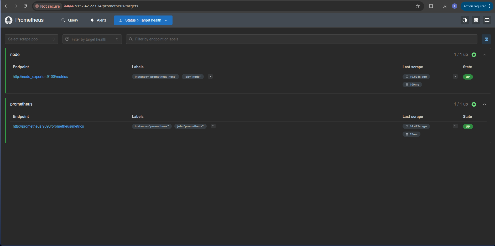
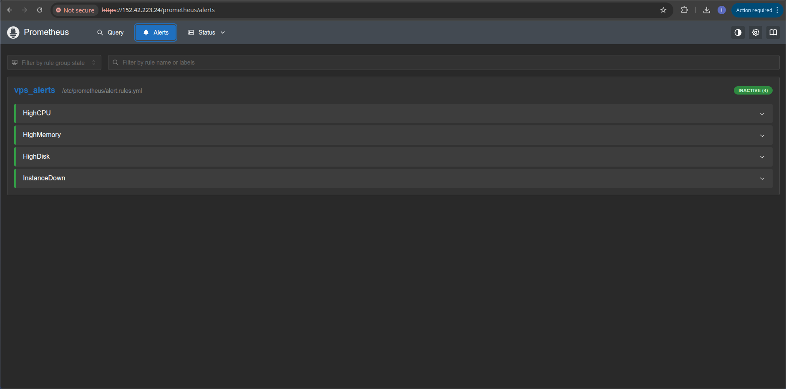
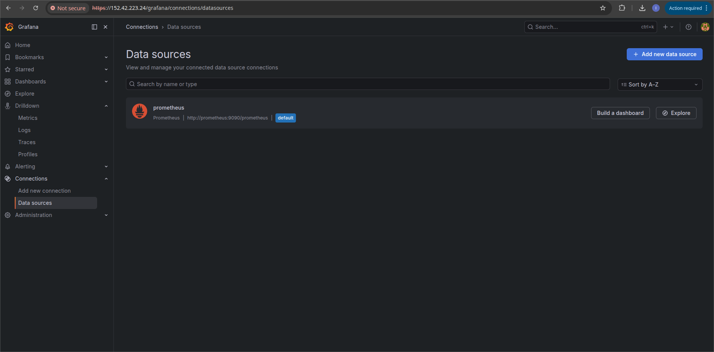
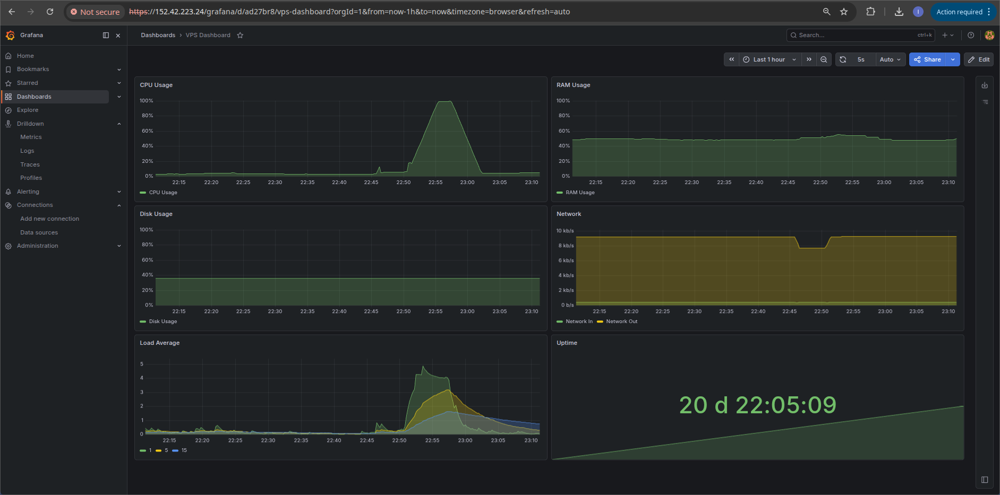
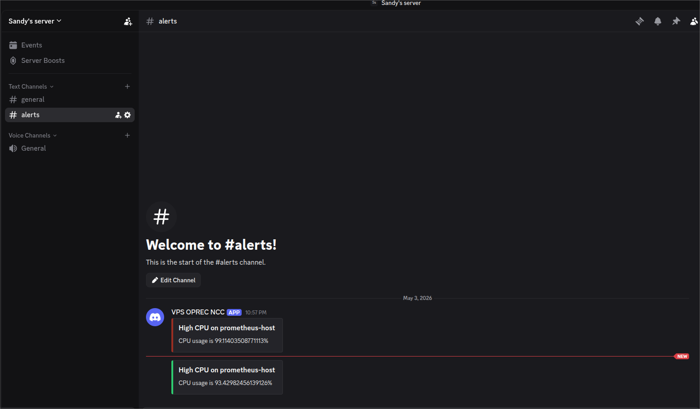

# Laporan Day 3 - Prometheus + Grafana Monitoring

## Ringkasan Pemenuhan

- Menyiapkan Prometheus sebagai tools monitoring dan metrics collection: terpenuhi (Prometheus + Node Exporter via Docker Compose).
- Menyiapkan Grafana sebagai tools visualisasi data: terpenuhi (Grafana terhubung ke Prometheus, diakses via nginx subpath).
- Mengkonfigurasi scraping metrics dari target: terpenuhi (Node Exporter scraping host metrics VPS).
- Membuat custom dashboard di Grafana: terpenuhi (dashboard manual tanpa template, berisi CPU, RAM, Disk, Network, Load, Uptime).

## Poin Opsional

- Sistem alerting: terpenuhi (Alertmanager dengan alert rules untuk CPU, Memory, Disk, dan instance down).
- Integrasi notifikasi eksternal: terpenuhi (email via SMTP Brevo / Discord webhook).
- Query PromQL kompleks: terpenuhi (`rate()`, `avg by()`, rasio filesystem, dan delta network).

## Deskripsi Arsitektur Sistem Monitoring

Sistem monitoring terdiri dari tiga komponen utama yang berjalan dalam satu Docker Compose stack:

**Prometheus** bertugas sebagai metrics collector dan time-series database. Prometheus melakukan scraping secara berkala (setiap 15 detik) ke target yang dikonfigurasi, menyimpan data, dan mengevaluasi alert rules.

**Node Exporter** berjalan di sisi host (dengan `pid: host` dan bind mount `/proc`, `/sys`, `/`) untuk mengekspos metrics sistem operasi VPS secara lengkap seperti CPU, RAM, disk, network, proses, dan lainnya ke Prometheus.

**Grafana** bertugas sebagai lapisan visualisasi. Grafana mengambil data dari Prometheus via HTTP internal Docker network dan menampilkannya dalam bentuk dashboard dan grafik.

**Alertmanager** menerima alert yang dikirim Prometheus saat rules terpenuhi, lalu meneruskannya ke notifikasi eksternal (email / Discord).

```text
VPS Host
├── /proc, /sys, /          <- bind mount ke node_exporter
│
Docker Network
├── node_exporter:9100      <- ekspos host metrics
├── prometheus:9090         <- scrape node_exporter, evaluasi rules
├── alertmanager:9093       <- terima alert dari prometheus
└── grafana:3000            <- visualisasi data dari prometheus
        |
        V
Nginx (443) -> /prometheus/, /grafana/
        |
        V
Browser / Email / Discord
```

Seluruh port hanya di-bind ke `127.0.0.1` sehingga tidak dapat diakses langsung dari internet — semua traffic masuk melalui Nginx pada port 443.

## Penjelasan Integrasi Prometheus dengan Grafana

Grafana terhubung ke Prometheus melalui Docker internal network menggunakan URL `http://prometheus:9090/prometheus`. Koneksi ini tidak melalui nginx sehingga tidak memerlukan autentikasi basic auth yang dipasang di nginx.

Setelah data source dikonfigurasi, setiap panel di Grafana menggunakan query PromQL yang dikirim ke Prometheus. Prometheus mengembalikan time-series data, lalu Grafana merendernya sebagai grafik, gauge, atau stat sesuai konfigurasi panel.

## Konfigurasi Prometheus

File `prometheus.yml`:

```yaml
global:
  scrape_interval: 15s
  evaluation_interval: 15s

rule_files:
  - /etc/prometheus/alert.rules.yml

alerting:
  alertmanagers:
    - static_configs:
        - targets: ["alertmanager:9093"]

scrape_configs:
  - job_name: "prometheus"
    metrics_path: /prometheus/metrics
    static_configs:
      - targets: ["prometheus:9090"]
        labels:
          instance: "prometheus"

  - job_name: "node"
    static_configs:
      - targets: ["node_exporter:9100"]
        labels:
          instance: "prometheus-host"
```

Catatan: `metrics_path` pada job `prometheus` diubah menjadi `/prometheus/metrics` karena Prometheus dikonfigurasi dengan `--web.route-prefix=/prometheus`.

File `alert.rules.yml`:

```yaml
groups:
  - name: vps_alerts
    rules:
      - alert: HighCPU
        expr: 100 - (avg by(instance) (rate(node_cpu_seconds_total{mode="idle"}[5m])) * 100) > 80
        for: 2m
        labels:
          severity: warning
        annotations:
          summary: "High CPU on {{ $labels.instance }}"
          description: "CPU usage is {{ $value }}%"

      - alert: HighMemory
        expr: 100 * (1 - (node_memory_MemAvailable_bytes / node_memory_MemTotal_bytes)) > 85
        for: 2m
        labels:
          severity: warning
        annotations:
          summary: "High Memory on {{ $labels.instance }}"
          description: "Memory usage is {{ $value }}%"

      - alert: HighDisk
        expr: 100 - (node_filesystem_avail_bytes{mountpoint="/"} / node_filesystem_size_bytes{mountpoint="/"} * 100) > 85
        for: 5m
        labels:
          severity: critical
        annotations:
          summary: "High Disk on {{ $labels.instance }}"
          description: "Disk usage is {{ $value }}%"

      - alert: InstanceDown
        expr: up == 0
        for: 1m
        labels:
          severity: critical
        annotations:
          summary: "Instance down: {{ $labels.instance }}"
```

## Screenshot Konfigurasi Prometheus

1. Prometheus Targets (`/prometheus/targets`):
  
1. Prometheus Alerts (`/prometheus/alerts`):
  

## Screenshot Konfigurasi Data Source di Grafana

1. Halaman tambah data source (Prometheus URL `http://prometheus:9090/prometheus`):
  

## Custom Dashboard

Dashboard dibuat manual tanpa menggunakan template bawaan, terdiri dari panel-panel berikut:

| Panel | Tipe | Query PromQL |
| ----- | ---- | ------------ |
| CPU Usage % | Time series | `100 - (avg by(instance) (rate(node_cpu_seconds_total{mode="idle"}[5m])) * 100)` |
| Memory Usage % | Gauge | `100 * (1 - (node_memory_MemAvailable_bytes / node_memory_MemTotal_bytes))` |
| Disk Usage % | Gauge | `100 - (node_filesystem_avail_bytes{mountpoint="/"} / node_filesystem_size_bytes{mountpoint="/"} * 100)` |
| Network In/Out | Time series | `rate(node_network_receive_bytes_total{device!="lo"}[5m])` / `rate(node_network_transmit_bytes_total{device!="lo"}[5m])` |
| System Load | Time series | `node_load1`, `node_load5`, `node_load15` |
| Uptime | Stat | `time() - node_boot_time_seconds` |

## Screenshot Custom Dashboard

1. Tampilan keseluruhan dashboard:
  

## Alur Monitoring

```text
Host Metrics (CPU, RAM, Disk, Network)
        |
        V
Node Exporter :9100
        |
        V  scrape setiap 15s
Prometheus :9090
        |               |
        V               V
  Simpan TSDB      Evaluasi alert.rules.yml
        |               |
        V               V
    Grafana        Alertmanager :9093
   query PromQL         |
   render grafik        V
                   Kirim notifikasi
                      (Discord)
```

1. **Metrics collection** — Node Exporter membaca `/proc` dan `/sys` dari host, mengekspos data dalam format Prometheus.
2. **Scraping** — Prometheus menarik data dari Node Exporter setiap 15 detik dan menyimpannya sebagai time-series.
3. **Evaluasi rules** — Setiap `evaluation_interval` (15 detik), Prometheus mengevaluasi alert rules. Jika kondisi terpenuhi selama durasi `for`, alert berpindah dari `pending` ke `firing`.
4. **Alerting** — Alert yang firing dikirim ke Alertmanager, yang kemudian meneruskannya ke email atau Discord.
5. **Visualisasi** — Grafana mengquery Prometheus secara berkala dan merender data sebagai grafik real-time di dashboard.

## Stress Test

Untuk memverifikasi alerting, dilakukan stress test menggunakan tool `stress`:

```bash
sudo apt install stress -y
stress --cpu $(nproc) --timeout 300
```

Setelah 2 menit CPU > 80%, alert `HighCPU` berpindah ke status `firing` dan notifikasi dikirim.

## Screenshot Hasil Alert

1. Alert `HighCPU` firing di Prometheus:
  

## Kendala

- **Docker bypass UFW** — Port yang di-expose Docker tidak mengikuti aturan UFW karena Docker menulis langsung ke iptables. Solusi: bind semua port ke `127.0.0.1` di Docker Compose (`127.0.0.1:9090:9090`) sehingga tidak dapat diakses dari luar.
- **Prometheus subpath** — Setelah menambahkan `--web.route-prefix=/prometheus`, scrape job prometheus sendiri gagal karena `metrics_path` masih mengarah ke `/metrics`. Solusi: tambahkan `metrics_path: /prometheus/metrics` pada job `prometheus` di `prometheus.yml`.
